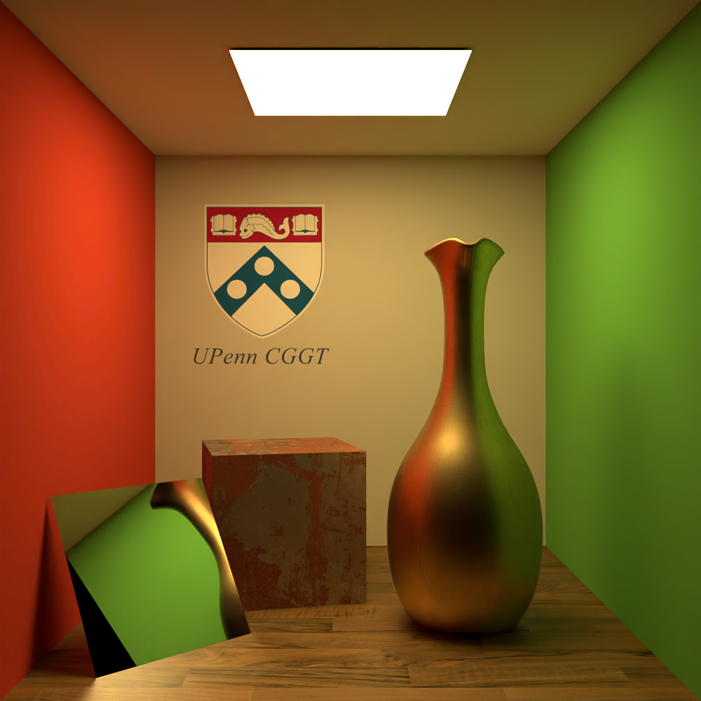
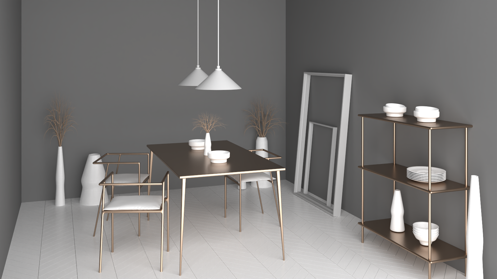
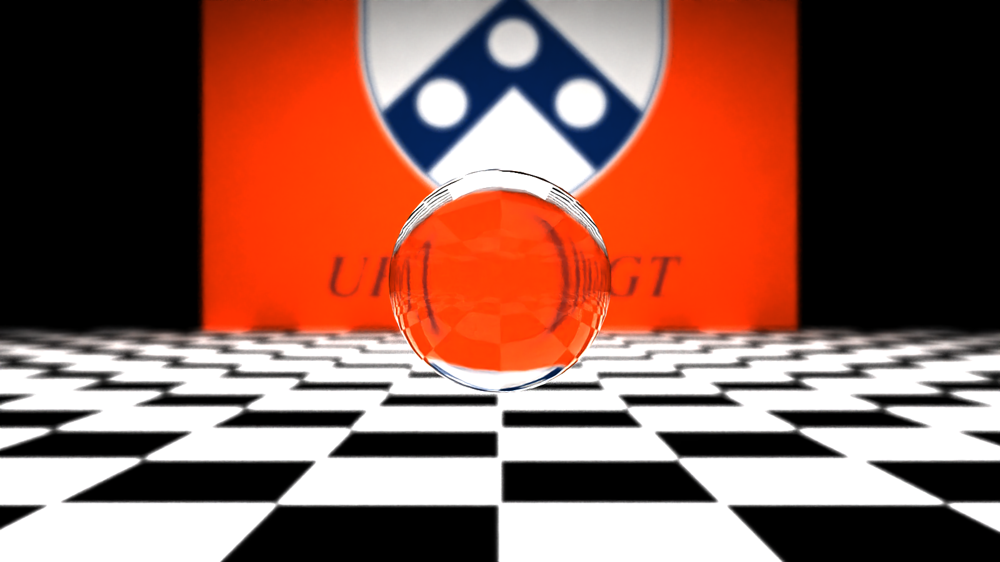
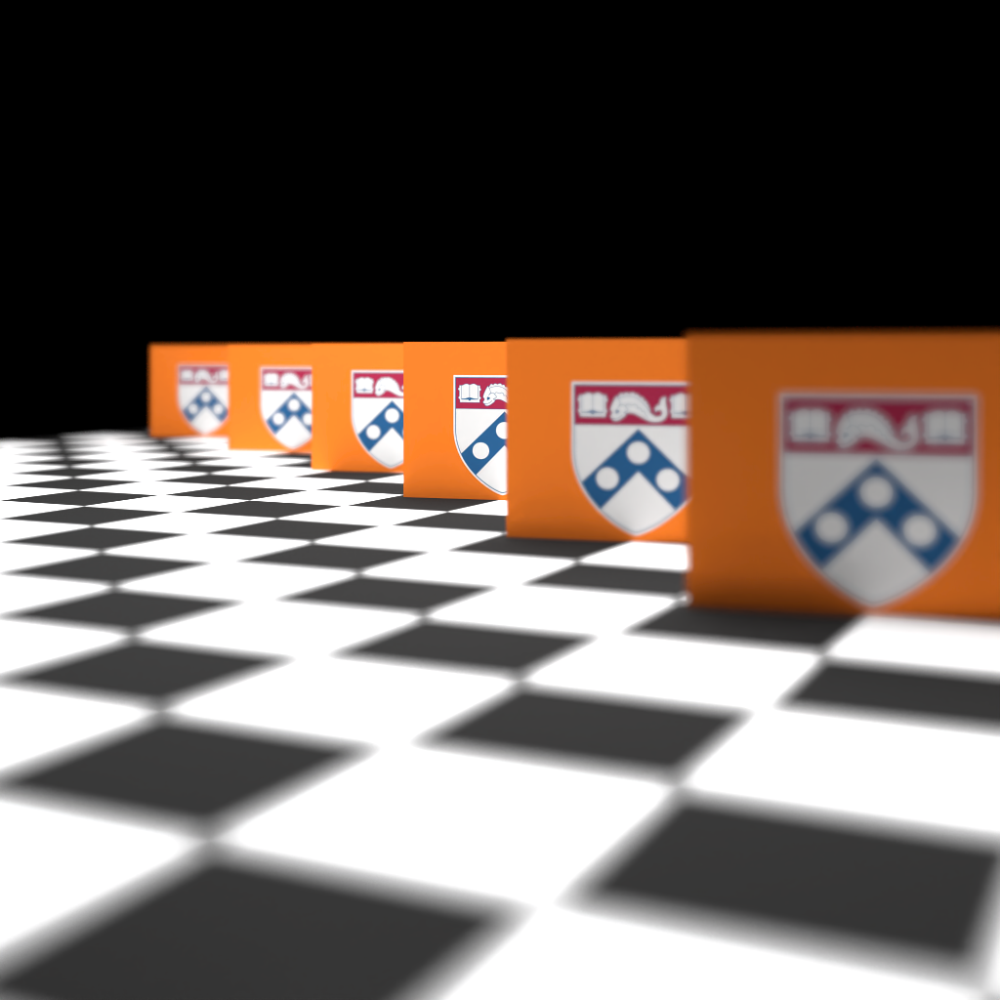
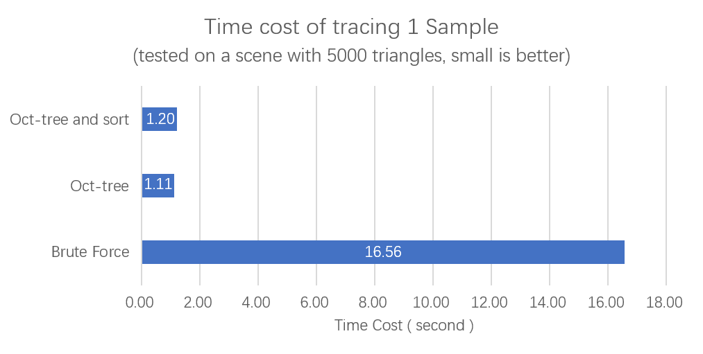
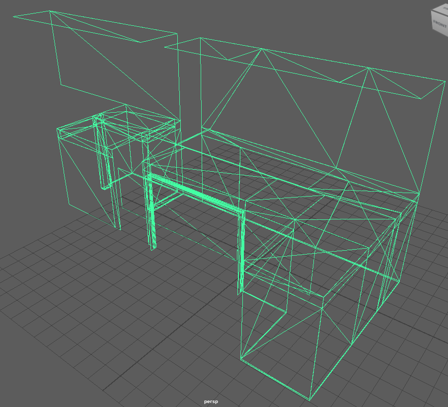
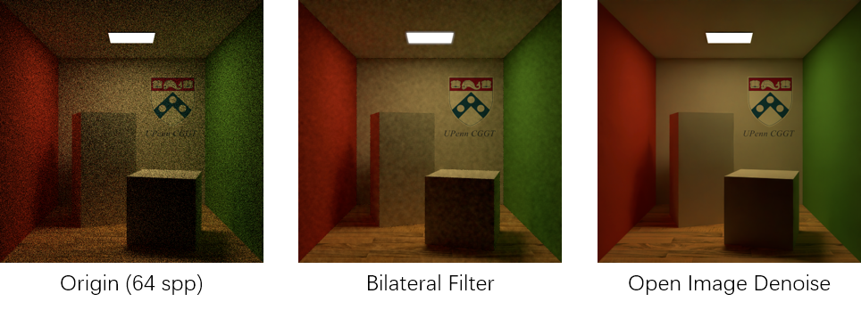

# Nagi

**University of Pennsylvania, CIS 565: GPU Programming and Architecture, Project 3**

* Alex Fu
  
  - [LinkedIn](https://www.linkedin.com/in/alex-fu-b47b67238/)
  - [Twitter](https://twitter.com/AlexFu8304)
  - [Personal Website](https://thecger.com/)
  
  Tested on: Windows 10, i7-10750H @ 2.60GHz, 16GB, GTX 3060 6GB



Nagi is a simple path tracer built in CUDA. As shown in the picture, it's capable of rendering photorealistic images of diffuse, mirror, metal, and glass materials with their own textures.

## Features

**Finished**

- [x] Mesh Loading
- [x] Texture Mapping
- [x] Denoiser
- [x] Oct-tree Structure
- [x] Refrection

**Working On**

- [ ] Skybox
- [ ] Preview Window

## Usage

```bash
Nagi.exe <scene file> [<output path>]
```

For example:

```bash
Nagi.exe ./res/cornell_box/cornell_box.json ./results
```

The scene is defined by a JSON file. It is very self-explanatory and contains rendering configurations. It currently supports 5 material types: Lambert, Mirror, Glass, Microfacet, and Light Source. It's also possible to add depth of field by setting the camera's f-number and focus distance (or a look-at point).

## Gallery







## Oct-tree

To accelerate the intersection test. I divide each model's triangles and store them in oct-tree structures. Then all objects will be passed into the denoiser in an array sorted by their volume. The path tracer will perform a depth-first search in the intersection test.
The triangle intersected with the shortest distance will be recorded. If the distance to an object is larger than the last recorded distance to the triangle, all its triangles will be surpassed.

## Performance Analysis

After introducing Oct-tree structure, a huge improvement of speed can be seen:



However, when a mesh is rectangular and contain large triangles, like this mesh from the Staircase scene, the oct-tree fails to divide it effectively.



The time cost for the Staircase scene increases to 8 seconds per spp. In general, the time cost of 1 spp varies from 0.2-2 seconds.

The performance slightly drops if rays are sorted according to their materials after the intersection. The stable sort function itself is costly so the improvement may be counteracted.

## Denoiser



I implemented a simple bilateral filter as the denoiser. I also added Intel's [Open Image Denoise](https://www.openimagedenoise.org/). You can choose them by setting the denoiser value in the scene definition to 1 or 2. Open Image Denoise's result is significantly better than the bilateral filter.
