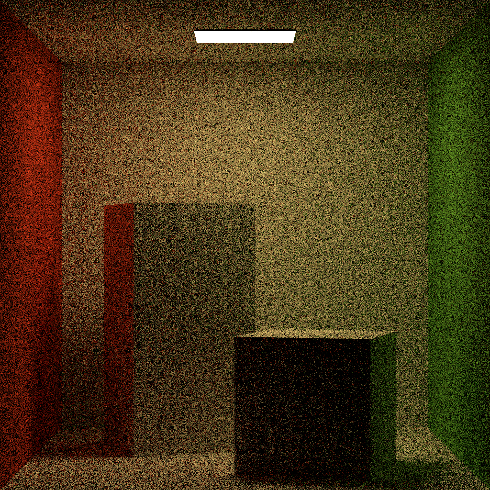
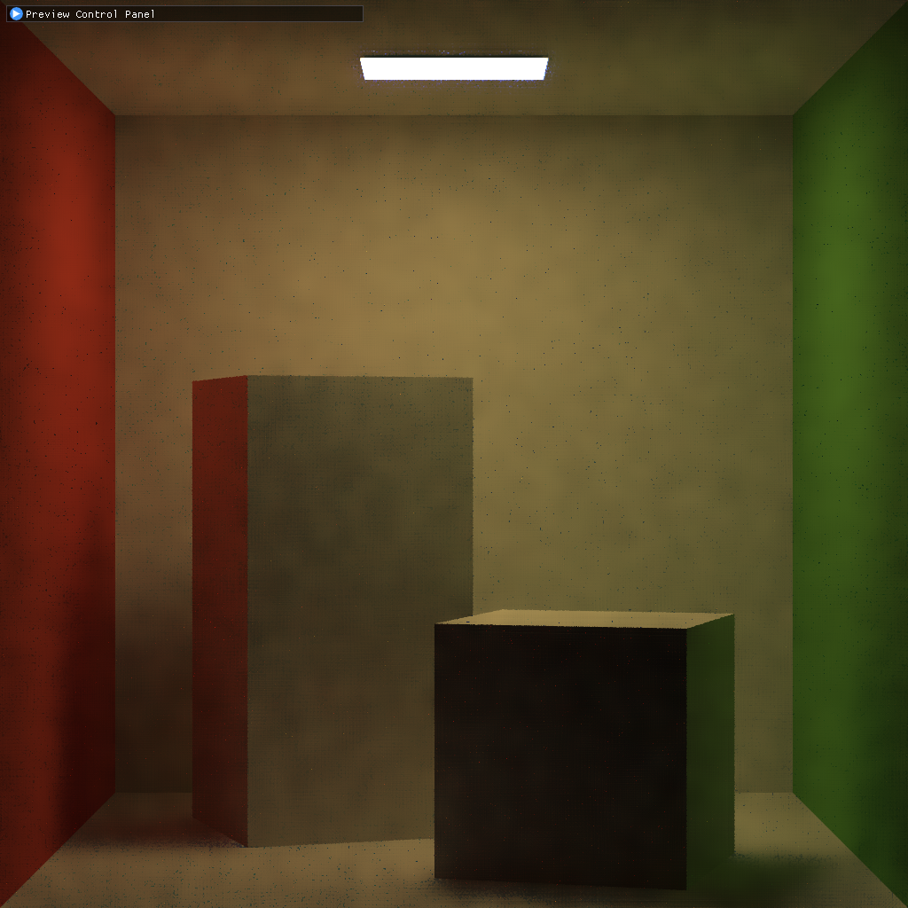
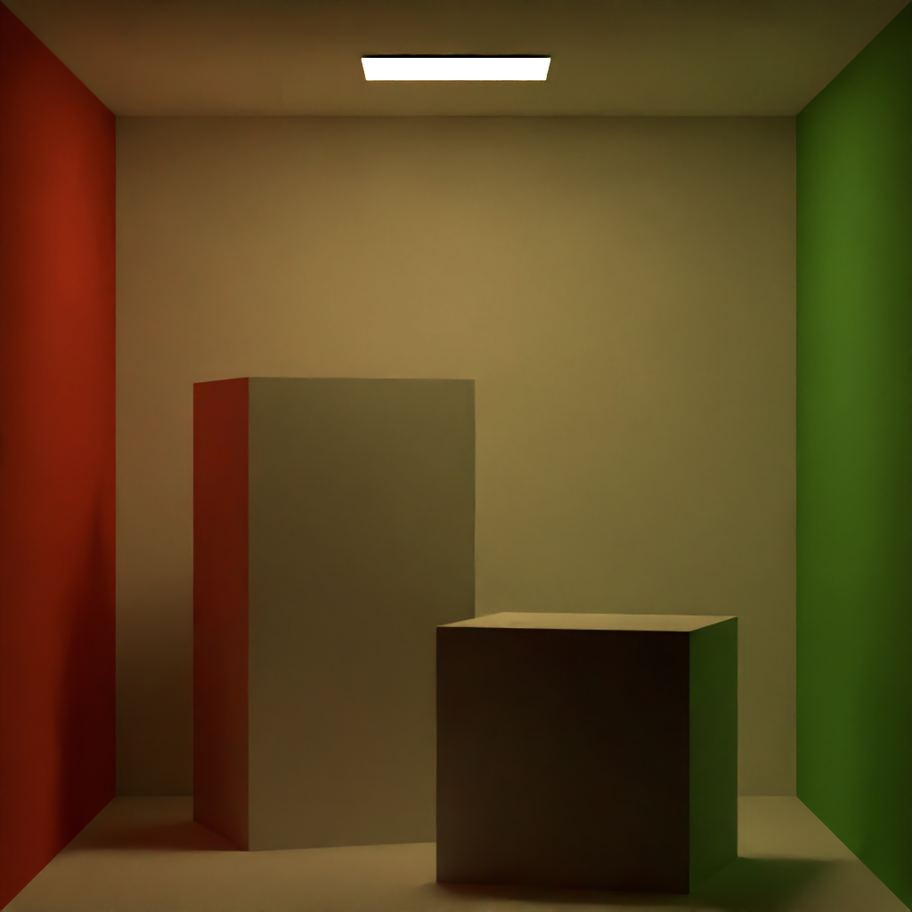

# Nagi

**University of Pennsylvania, CIS 565: GPU Programming and Architecture, Project 3**

* Alex Fu
  
  - [LinkedIn](https://www.linkedin.com/in/alex-fu-b47b67238/)
  - [Twitter](https://twitter.com/AlexFu8304)
  - [Personal Website](https://thecger.com/)
  
  Tested on: Windows 10, i7-10750H @ 2.60GHz, 16GB, GTX 3060 6GB


Nagi is a simple path tracer built in CUDA. As shown in the picture, it's capable of rendering photorealistic images of diffuse, mirror, metal, and glass materials with their own textures.

## Features

<video src="https://user-images.githubusercontent.com/28486541/198067385-cf9353ab-5a11-40fb-b030-91e3afd91056.mp4"></video>

**Finished**

- [x] Mesh Loading
- [x] Texture Mapping
- [x] Denoiser
- [x] Bounding Volume Hierarchy
- [x] Refrection
- [x] Skybox
- [x] Preview Window

**Working On**

- [ ] Direct Light Sampling
- [ ] Importance Sampling On Skybox
- [ ] Multiple Importance Sampling
- [ ] Multithread GUI

## Usage

```bash
Nagi.exe <scene file> [<output path>]
```

For example:

```bash
Nagi.exe ./res/cornell_box/cornell_box.json ./results
```

The scene is defined by a JSON file. It is very self-explanatory and contains rendering configurations. It currently supports 5 material types: Lambert, Specular, Glass, Microfacet, and Light Source. It's also possible to add depth of field by setting the camera's f-number and focus distance (or a look-at point).

## Gallery


Artisit: [NewSee2l035](https://blendswap.com/profile/35454)


Artisit: [James Ray Cock](https://www.artstation.com/jamesray), [Greg Zaal](https://gregzaal.com/), Dimitrios Savva


Artisit: [JpArtSky](https://www.cgtrader.com/jpartsky)


## Acceleration Structure

To accelerate the intersection test, at first, I divide each model's triangles and store them in oct-tree structures. Then all objects will be passed into the path tracer in an array sorted by their volume. The path tracer will perform a depth-first search in the intersection test.

Then I realized using a bottom-to-top bounding volume hiearchy is more optimal. And the stack for DFS consume too much memories so I adopted the [BVH described in PBRT](https://www.pbr-book.org/3ed-2018/Primitives_and_Intersection_Acceleration/Bounding_Volume_Hierarchies) and [the stack-free traversal](https://arxiv.org/abs/1505.06022).

The triangle intersected with the shortest distance will be recorded. If the distance to an object is larger than the last recorded distance to the triangle, all its triangles will be surpassed.

## Performance Analysis

After dividing the scene into an oct-tree structure, a huge improvement of speed can be seen:


It is interesting that sorting the rays according to their material slightly lower the performance. The overhead of sorting might counteract the improvement brought by memory coalescing.

However, when a mesh is rectangular and contain large triangles, like this mesh from the [Modern Hall scene](http://www.blendswap.com/blends/view/51997), the oct-tree fails to divide it effectively.


The time cost for the Staircase scene increases to 8 seconds per spp. Therefore, I replaced the oct-tree with BVH and adopted the stack-free traversal. This significantly improved the performance. The timecost for the Modern Hall scene droped to 10ms!

## [Denoiser](https://github.com/IwakuraRein/CIS-565-4-CUDA-Denoiser/blob/base-code/README.md)

<table>
    <tr>
        <th>original</th>
        <th>real-time denoiser</th>
        <th>Open Image Denoise</th>
    </tr>
    <tr>
        <th></th>
        <th></th>
        <th></th>
    </tr>
</table>

For the real-time preview, I implemented [SVGF](https://dl.acm.org/doi/10.1145/3105762.3105770) as the denoiser. For the final result, I implemented Intel's [Open Image Denoise](https://www.openimagedenoise.org/).
