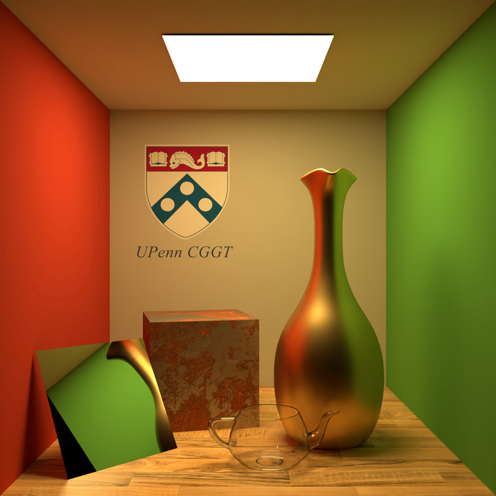
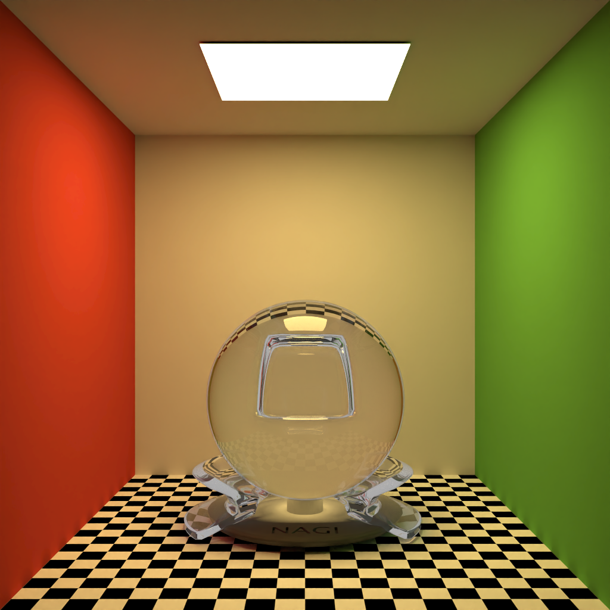
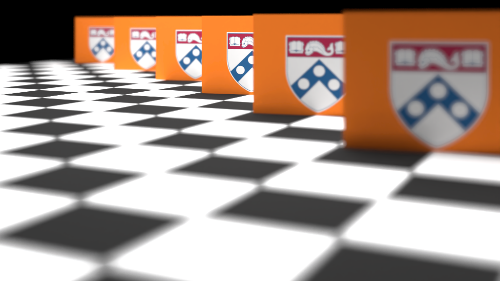

# Nagi



Nagi is a simple path tracer built in CUDA. As shown in the picture, it's capable of rendering photorealistic images of diffuse, mirror, metal, and glass materials with their own textures.

## Features

**Finished**

- [x] Mesh Loading
- [x] Texture Mapping
- [x] Denoiser
- [x] Oct-tree Structure
- [x] Refrection

**Working On**

- [ ] Skybox
- [ ] Preview Window

## Usage

```bash
Nagi.exe <scene file> [<output path>]
```

For example:

```bash
Nagi.exe ./res/cornell_box/cornell_box.json ./results
```

The scene is defined by a JSON file. It is very self-explainary and contains rendering configurations. It currently support 5 material types: Lambert, Mirror, Glass, Microfacet, and Light Source. It's also possible to add depth of field by setting camera's f-number and focus distance (or a look-at point).

## Gallary






## Oct-tree

To accelarate the intersection test. I divide each model's triangles and store them in oct-tree structures. Then all objects will be passed into the denoiser in an array sorted by their volume. The path tracer will perform a depth first search in the intersection test.

The triangle intersected with the shortest distance will be recorded. If the distance to an object is larger than the last recorded distance to the triangle, all its triangles will be supassed.

## Performance Analysis


## Denoiser


I implemented a simple bilateral filter as the denoiser. I also added Intel's [Open Image Denoise](https://www.openimagedenoise.org/). You can choose them by setting the denoiser value in the scene definition to 1 or 2. Open Image Denoise's result is significantly better than the bilateral filter.
